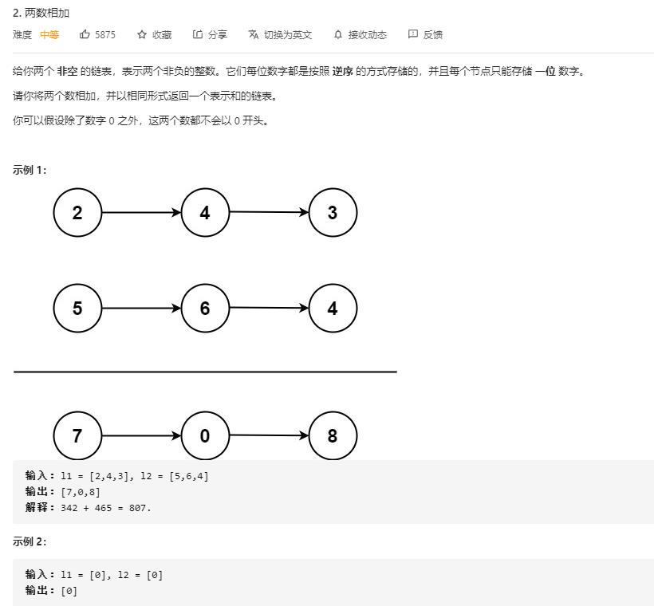

# add_two_numbers

## 题目截图
 

## 思路 两数相加

    # Definition for singly-linked list.
    # class ListNode:
    #     def __init__(self, val=0, next=None):
    #         self.val = val
    #         self.next = next
    class Solution:
        def addTwoNumbers(self, l1: ListNode, l2: ListNode) -> ListNode:
            res = ListNode(0)
            tmp = res
            # ten 为进位， one 为个位数
            ten, one = 0, 0
            while l1 or l2:
                s = 0
                if l1:
                    s += l1.val
                    l1 = l1.next
                if l2:
                    s += l2.val
                    l2 = l2.next
                s += ten
                ten = s // 10
                one = s % 10
                tmp.next = ListNode(one)
                tmp = tmp.next
            if ten:
                tmp.next = ListNode(ten)
            return res.next
