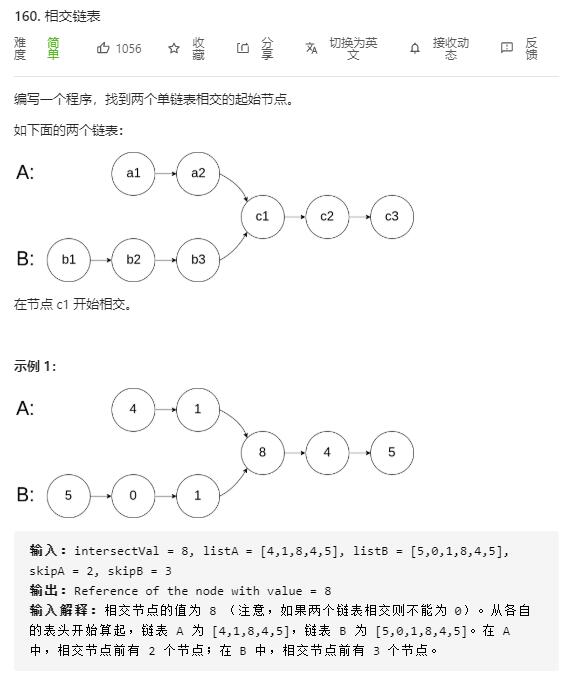

# intersection_of_two_linked_lists

## 题目截图
 

## 思路 浪漫相遇

`A` 走完自己的走 `B`的

`B` 走完自己的走 `A`的

最终会相遇在交点或 `null`

- 时间复杂度：O(M + N)
- 空间复杂度：O(1)，常数个变量

    # Definition for singly-linked list.
    # class ListNode:
    #     def __init__(self, x):
    #         self.val = x
    #         self.next = None
    
    class Solution:
        def getIntersectionNode(self, headA: ListNode, headB: ListNode) -> ListNode:
            i, j = headA, headB
            while i != j:
                i = i.next if i else headB
                j = j.next if j else headA
            return i
            
