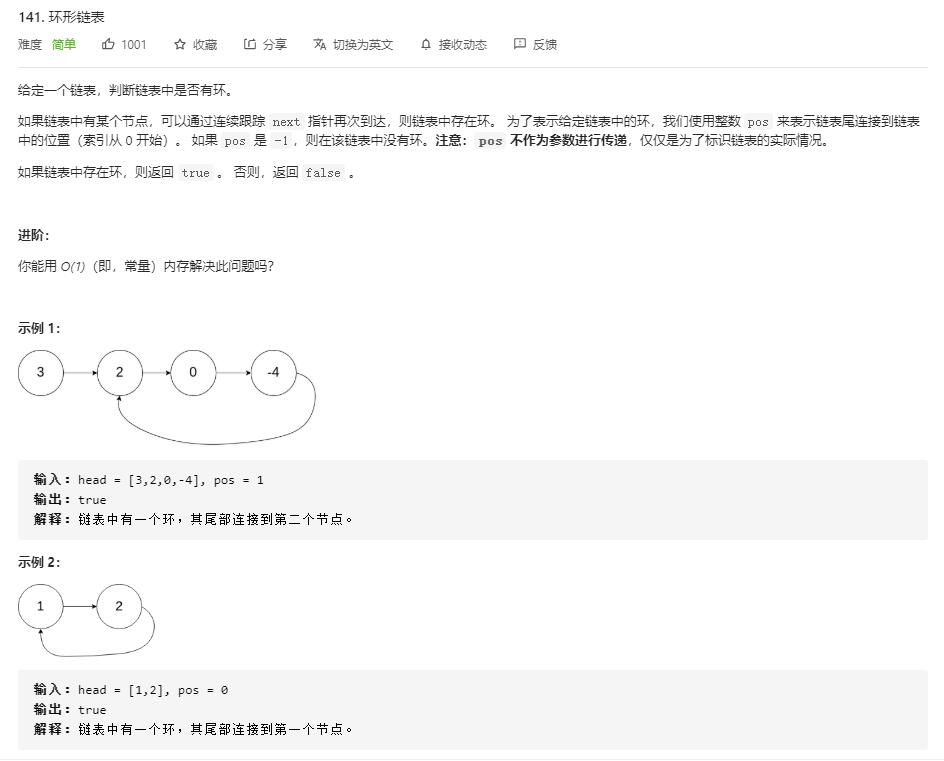

# linked_list_cycle

## 题目截图
 

## 思路 快慢指针
- 时间复杂度: `O(N)`
- 空间复杂度：`O(1)`

    # Definition for singly-linked list.
    # class ListNode:
    #     def __init__(self, x):
    #         self.val = x
    #         self.next = None
    
    class Solution:
        def hasCycle(self, head: ListNode) -> bool:
            # 龟兔赛跑
            # 两个指针 i, j, j 指针速度是 i 的两倍，
            if not head:return False
            i = j = head
            while j and j.next:
                i = i.next
                j = j.next.next
                if i == j:
                    return True
            return False

