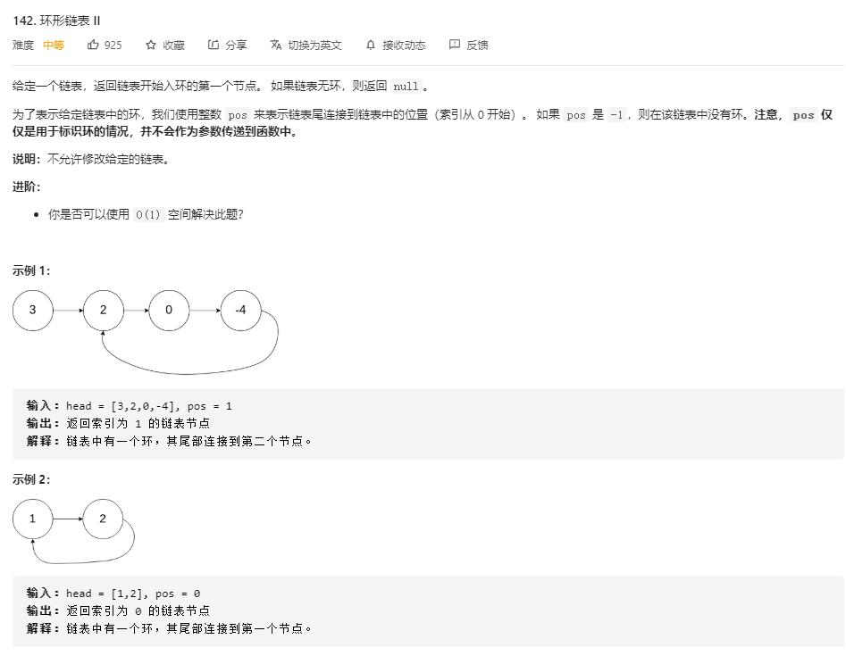

# linked_list_cycle_II

## 题目截图
 

## 思路 快慢指针
- 时间复杂度: `O(N)`
- 空间复杂度：`O(1)`

    # Definition for singly-linked list.
    # class ListNode:
    #     def __init__(self, x):
    #         self.val = x
    #         self.next = None
    
    class Solution:
        def detectCycle(self, head: ListNode) -> ListNode:
            # 快慢指针
            if not head or not head.next: return 
            slow = fast = head
            while fast and fast.next:
                slow = slow.next
                fast = fast.next.next
                if slow == fast:
                    break
            if not fast or not fast.next: return
            slow = head
            while slow != fast:
                slow = slow.next
                fast = fast.next
            return slow

