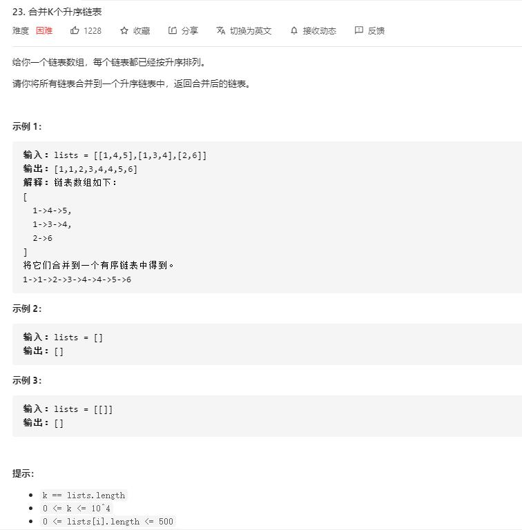

# merge_k__sorted_lists

## 题目截图
 

## 思路一 分治 + 递归
 

    # Definition for singly-linked list.
    # class ListNode:
    #     def __init__(self, val=0, next=None):
    #         self.val = val
    #         self.next = next
    class Solution:
        def mergeKLists(self, lists: List[ListNode]) -> ListNode:
            if not lists:
                return
            return self.merge(lists, 0, len(lists) - 1)
        def merge(self, lists, l, r):
            if l == r:
                return lists[l]
            mid = l + (r - l) // 2
            l1 = self.merge(lists, l, mid)
            l2 = self.merge(lists, mid + 1, r)
            return self.merge_two(l1, l2)
        def merge_two(self, l1, l2):
            if not l1:
                return l2
            if not l2:
                return l1
            if l1.val < l2.val:
                l1.next = self.merge_two(l1.next, l2)
                return l1
            else:
                l2.next = self.merge_two(l1, l2.next)
                return l2

