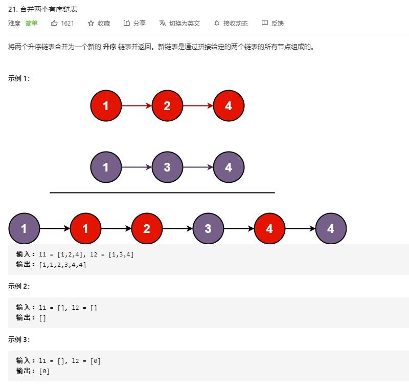

# merge_two_sorted_lists

## 题目截图
 

## 思路一 遍历
- 时间复杂度： `O(M + N)` ,遍历一次
- 空间复杂度： `O(1)` ,常数个变量

    # Definition for singly-linked list.
    # class ListNode:
    #     def __init__(self, val=0, next=None):
    #         self.val = val
    #         self.next = next
    class Solution:
        def mergeTwoLists(self, l1: ListNode, l2: ListNode) -> ListNode:
            # 辅助头结点 res 及遍历指针 i
            res = ListNode(0)
            i = res
            while l1 and l2:
                if l1.val < l2.val:
                    i.next = l1
                    i = i.next
                    l1 = l1.next
                else:
                    i.next = l2
                    i = i.next
                    l2 = l2.next
            if l1:
                i.next = l1
            if l2:
                i.next = l2
            return res.next

## 思路二 递归

- 时间复杂度： `O(M + N)` ,遍历一次
- 空间复杂度： `O(M + N)` ,常数个变量

    # Definition for singly-linked list.
    # class ListNode:
    #     def __init__(self, val=0, next=None):
    #         self.val = val
    #         self.next = next
    class Solution:
        def mergeTwoLists(self, l1: ListNode, l2: ListNode) -> ListNode:
            if not l1:
                return l2
            if not l2:
                return l1
            if l1.val < l2.val:
                l1.next = self.mergeTwoLists(l1.next, l2)
                return l1
            else:
                l2.next = self.mergeTwoLists(l1, l2.next)
                return l2
