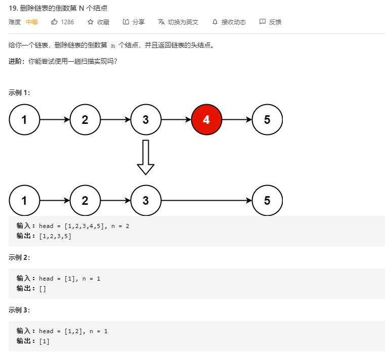

# remove_nth_node_from_end_of_list

## 题目截图
 

## 思路 双指针

- 时间复杂度： `O(N)` ,遍历一次
- 空间复杂度： `O(1)` ,常数个变量

    # Definition for singly-linked list.
    # class ListNode:
    #     def __init__(self, val=0, next=None):
    #         self.val = val
    #         self.next = next
    class Solution:
        def removeNthFromEnd(self, head: ListNode, n: int) -> ListNode:
            # 双指针i, j
            # j 指针先走 n 个位置，然后两指针同时往后走，当 j 指针走到末尾，则删除 i 指针下个节点即可
            # 注意其边界条件，可能删除的是第一个节点
            # 添加一个辅助节点指向头结点
            tmp = ListNode(0)
            tmp.next = head
            i = j = tmp
            # 倒数第 n 个节点说明至少含 n 个节点
            # 故先将 j 指针向后移 n 次
            for _ in range(n):
                j = j.next
            # 然后同时将 i, j 指针后移，直到 j 到达链表尾， i 所指的为需要删除的节点的前一个节点
            while j.next:
                i = i.next
                j = j.next
            i.next = i.next.next
            return tmp.next
