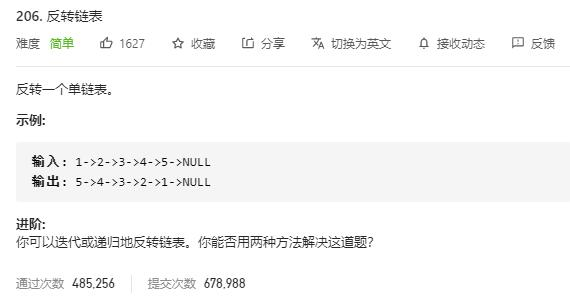

# reverse_linked_list

## 题目截图
 

## 思路一 迭代

    # Definition for singly-linked list.
    # class ListNode:
    #     def __init__(self, val=0, next=None):
    #         self.val = val
    #         self.next = next
    class Solution:
        def reverseList(self, head: ListNode) -> ListNode:
            # 迭代
            # 两个指针迭代反转
            if not head or not head.next:
                return head
            i, j = head, head.next
            head.next = None
            while j:
                tmp = j.next
                j.next = i
                i = j
                j = tmp
            return i
            
            
## 思路二 递归

    # Definition for singly-linked list.
    # class ListNode:
    #     def __init__(self, val=0, next=None):
    #         self.val = val
    #         self.next = next
    class Solution:
        def reverseList(self, head: ListNode) -> ListNode:
            # 迭代
            # 两个指针迭代反转
            if not head.next:
                return head
            res = self.reverseList(head.next)
            head.next.next = head
            head.next = None
            return res
        
        
   
## 思路三 双指针

    # Definition for singly-linked list.
    # class ListNode:
    #     def __init__(self, val=0, next=None):
    #         self.val = val
    #         self.next = next
    class Solution:
        def reverseList(self, head: ListNode) -> ListNode:
            # 双指针
            if not head: return head
            cur = head
            while head.next:
                tmp = head.next.next
                head.next.next = cur
                cur = head.next
                head.next = tmp
            return cur