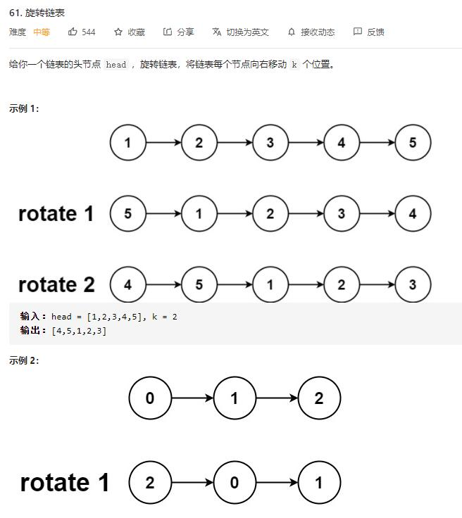

# rotate_list

## 题目截图
 

## 思路 闭环

    # Definition for singly-linked list.
    # class ListNode:
    #     def __init__(self, val=0, next=None):
    #         self.val = val
    #         self.next = next
    class Solution:
        def rotateRight(self, head: ListNode, k: int) -> ListNode:
            if not head or not head.next: return head
            tail, n = head, 1
            # 使 tail 指向链表尾
            while tail.next:
                tail = tail.next
                n += 1
            k %= n
            tail.next = head
            for i in range(n - k):
                tail = tail.next
            head = tail.next
            tail.next = None
            return head
            
