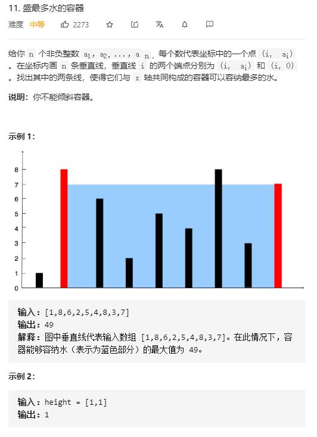

# container_with_most_water

## 题目截图
 

## 思路 双指针

- 思路：两个指针分别指向两边每次较短板向中间靠近，直到两指针相遇，记录下过程中最大值即结果

- 证明：假设当前状态 s(i, j) ，此时短板为 i ,则由 s(i, j) 到状态 s(i - 1, j) 舍弃了状态 s(i, j - 1), s(i, j - 2) .... s(i, i + 1),而这些状态都比 s(i, j) 小，所以并未丢失最大解。

    class Solution:
    def maxArea(self, height: List[int]) -> int:
        i, j, res = 0, len(height) - 1, 0
        while i < j:
            if height[i] <= height[j]:
                res = max(res, (j - i) * height[i])
                i += 1
            else:
                res = max(res, (j - i) * height[j])
                j -= 1
        return res

- 时间复杂度：O(N), 遍历一遍数组
- 空间复杂度：O(1), 两个指针变量