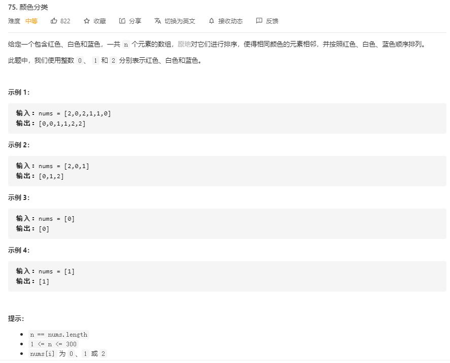

# sort_colors

## 题目截图
 

## 思路 双指针

- 双指针 `p0`, `p2` :一个用来交换`0`, 一个用来交换 `2`
- 使用指针 `i` 进行遍历
    - 当遇到 `0`时，与 `p0`交换，`p0 += 1`，`i += 1`
    - 当遇到 `2`时，与 `p2`交换，`p2 -= 1`，注意此时不能直接跳过 `i`, 应当继续对`i`元素进行判断
    - 之所以遇上 `0`时可以直接交换是因为保证了 `i` 之前的元素只有`0`,`1`且是顺序排列，而遇上的是`2`的话交换后面的元素到`i`该元素数字都有可能
    
    

    class Solution:
    def sortColors(self, nums: List[int]) -> None:
        """
        Do not return anything, modify nums in-place instead.
        """
        # 双指针p0, p2: 一个用来交换 0, 一个用来交换 2
        # 使用指针 i 遍历：
        i, p0, p2 = 0, 0, len(nums) - 1
        while i <= p2:
            if nums[i] == 0:
                nums[i], nums[p0] = nums[p0], nums[i]
                p0 += 1
                i += 1
            elif nums[i] == 2:
                nums[i], nums[p2] = nums[p2], nums[i]
                p2 -= 1
            else:
                i += 1
 
- 时间复杂度：O(N), 遍历一遍数组时间复杂度为 O(N)
- 空间复杂度：O(1), 常数个指针变量