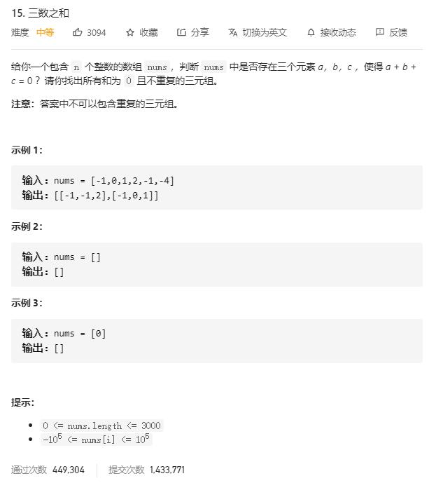

# three_sum

## 题目截图
 

## 思路 排序 + 双指针

- 第一步：排序
- 第二步：固定一个指针 k 在最左边，使用双指针 i, j 遍历右边数组，注意 i, j, k 在遍历时需要跳过重复的元素。

- 时间复杂度：O($ N^2 $), k 遍历一遍数组时间复杂度为 O(N), i, j 遍历时间复杂度为O(N)
- 空间复杂度：O(1), 常数个指针变量

    class Solution:
    def threeSum(self, nums: [int]) -> [[int]]:
        nums.sort()
        res, k = [], 0
        for k in range(len(nums) - 2):
            if nums[k] > 0: break # 1. because of j > i > k.
            if k > 0 and nums[k] == nums[k - 1]: continue # 2. skip the same `nums[k]`.
            i, j = k + 1, len(nums) - 1
            while i < j: # 3. double pointer
                s = nums[k] + nums[i] + nums[j]
                if s < 0:
                    i += 1
                    while i < j and nums[i] == nums[i - 1]: i += 1
                elif s > 0:
                    j -= 1
                    while i < j and nums[j] == nums[j + 1]: j -= 1
                else:
                    res.append([nums[k], nums[i], nums[j]])
                    i += 1
                    j -= 1
                    while i < j and nums[i] == nums[i - 1]: i += 1
                    while i < j and nums[j] == nums[j + 1]: j -= 1
        return res