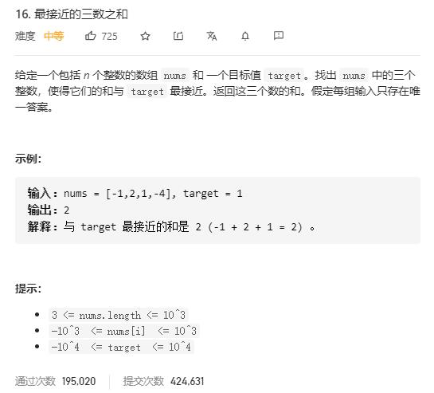

# three_sum

## 题目截图
 

## 思路 排序 + 双指针

- 第一步：排序
- 第二步：固定一个指针 k 在最左边，使用双指针 i, j 遍历右边数组，注意 i, j, k 在遍历时需要跳过重复的元素。期间更新res,若遍历到结果为 0 则直接返回。

    class Solution:
    def threeSumClosest(self, nums: List[int], target: int) -> int:
        nums = sorted(nums)
        res = nums[0] + nums[1] + nums[2]
        for k in range(len(nums) - 2):
            if k > 0 and nums[k] == nums[k - 1]: continue
            i, j = k + 1, len(nums) - 1
            while i < j:
                s = nums[k] + nums[i] + nums[j]
                if abs(s - target) < abs(res - target): res = s
                if s > target:
                    j -= 1
                    while i < j and nums[j] == nums[j + 1]:
                        j -= 1
                elif s < target:
                    i += 1
                    while i < j and nums[i] == nums[i - 1]:
                        i += 1
                else:
                    return target
        return res

 
- 时间复杂度：O($ N^2 $), k 遍历一遍数组时间复杂度为 O(N), i, j 遍历时间复杂度为O(N)
- 空间复杂度：O(1), 常数个指针变量