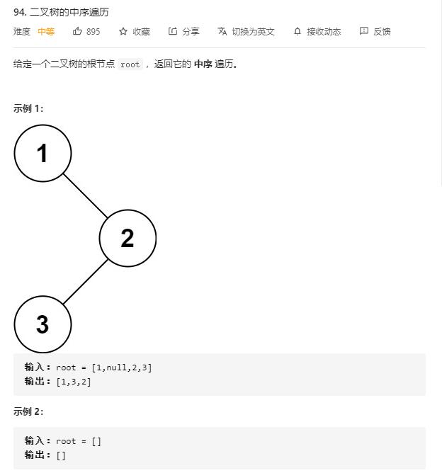

# binary_tree_inorder_traversal

## 题目截图
 

## 思路一 递归

- 时间复杂度：`O(N)`,对`N`个节点进行了遍历
- 空间复杂度：`O(N)`,栈最大深度为`N`
  
  
    # Definition for a binary tree node.
    # class TreeNode:
    #     def __init__(self, val=0, left=None, right=None):
    #         self.val = val
    #         self.left = left
    #         self.right = right
    class Solution:
        def inorderTraversal(self, root: TreeNode) -> List[int]:
            # dfs
            # 出口：当前节点为叶节点
            res = []
            def dfs(res, root):
                if not root:
                    return
                dfs(res, root.left)
                res.append(root.val)
                dfs(res, root.right)
            dfs(res, root)
            return res
            
            
# 思路二 莫里斯遍历

即将二叉树变成链表，如下图所示：

之所以能这样做，是因为中序遍历顺序是 `[左 | 根 | 右]`

    # Definition for a binary tree node.
    # class TreeNode:
    #     def __init__(self, val=0, left=None, right=None):
    #         self.val = val
    #         self.left = left
    #         self.right = right
    class Solution:
        def inorderTraversal(self, root: TreeNode) -> List[int]:
            res = []
            # 当当前节点还没有判断时
            while root:
                # 如果左节点不为空
                # 将 root 节点及 root 节点右子树挂到 root.left 的最右节点
                if root.left:
                    pre = root.left
                    while pre.right:
                        pre = pre.right
                    pre.right = root
                    tmp = root.left
                    root.left = None
                    root = tmp
                # 如果左节点为空
                # 将 root 输出，继续迭代右子树节点
                else:
                    res.append(root.val)
                    root = root.right
            return res
