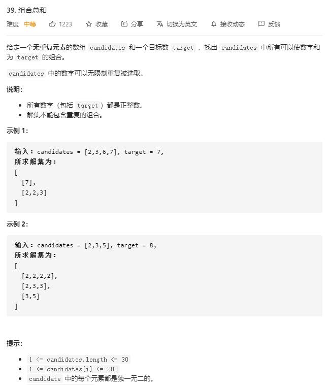

# combination_sum

## 题目截图
 

## 思路 递归
  
  本题难点在于不能有重复的路径，故需要进行剪枝，如下图所示：
  由于当选择了第一个点后，会遍历选择第二个点，所以在第二层选择第二个点后，无需再对第一个点进行判断。
  因此可在递归函数中加入`begin`参数，用于当前子树遍历时跳过前面的点
  
  
  
  
  递归：
  - 递归参数:
    - `index`: 将要选择的数的起点
    - `target`: 当前的目标和
    - `path`: 已经过的路径
  - 结束条件：
    1. 当前 `target == 0`, 即已经到达叶节点
    2. 当前 `target < 0`, 即此路径不行
  - 递归工作：
    - 从起点开始递归每一个可能的参数
  
  _注意：由于python特性，传递形参 `path + [candidates[i]` 时会产生新的列表，故无需考虑回溯_
    
    class Solution:
    def combinationSum(self, candidates: List[int], target: int) -> List[List[int]]:
        res = []
        # 回溯
        def dfs(begin, target, path):
            # 当前剩余的 target 数值
            if target == 0:
                res.append(path)
                return
            elif target < 0:
                return
            for i in range(begin, len(candidates)):
                dfs(i, target - candidates[i], path + [candidates[i]])

        dfs(0, target, [])
        return res
