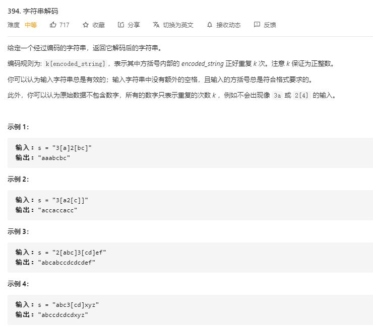

# decode_string

## 题目截图
 

## 思路 递归

[大佬思路](https://leetcode-cn.com/problems/decode-string/solution/decode-string-fu-zhu-zhan-fa-di-gui-fa-by-jyd/)

    class Solution:
    def decodeString(self, s: str) -> str:
        def decoder(start, end):
            if start == end:
                return s[start]
            tmp, i = [], start
            while start <= end:
                times = ord(s[start]) - ord('0')
                if 0 < times < 10:
                    start += 1
                    tmp_times = ord(s[start]) - ord('0')
                    while 0 <= tmp_times < 10:
                        times = times * 10 + tmp_times
                        start += 1
                        tmp_times = ord(s[start]) - ord('0')
                    i = start + 1
                    start += 1
                    flag = 1
                    while start <= end:
                        start += 1
                        if s[start] == '[':
                            flag += 1
                        if s[start] == ']':
                            flag -= 1
                            if flag == 0:
                                tmp.append(times * decoder(i, start - 1))
                                start += 1
                                break

                else:
                    tmp.append(s[start])
                    start += 1
            return ''.join(tmp)
        return decoder(0, len(s) - 1)

## 思路二 栈

    # 解法一
    class Solution:
        def decodeString(self, s: str) -> str:
            # 采用栈来保存前面的 multi 和 res
            stack, res, multi = [], "", 0
            for c in s:
                if c == '[':
                    stack.append([res, multi])
                    res, multi = '', 0
                elif c == ']':
                    latest_res, latest_multi = stack.pop()
                    res = latest_res + res * latest_multi
                elif '0' <= c <= '9':
                    multi = multi * 10 + int(c)
                else:
                    res += c
            return res
        

    # 解法二   
    class Solution:
    def decodeString(self, s: str) -> str:
        def dfs(s, i):
            res, multi = "", 0
            while i < len(s):
                if '0' <= s[i] <= '9':
                    multi = multi * 10 + int(s[i])
                elif s[i] == '[':
                    i, tmp = dfs(s, i + 1)
                    res += multi * tmp
                    multi = 0
                # ']'为终止条件
                elif s[i] == ']':
                    # 这里的返回一定是到不了结尾的
                    return i, res
                else:
                    res += s[i]
                i += 1
            return res
        return dfs(s, 0)       