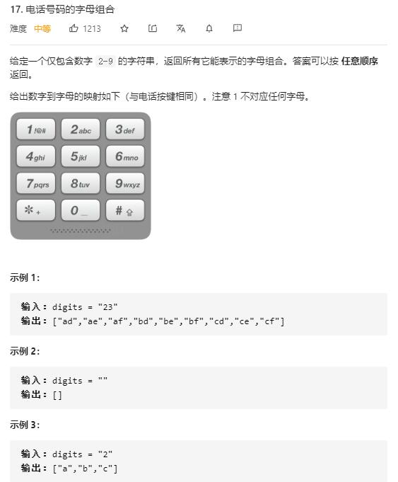

# letter_combinations_of_a_phone_number

## 题目截图
 

## 思路 递归
  

    class Solution:
    def letterCombinations(self, digits: str) -> List[str]:
        res = []
        if not digits:
            return res
        def dfs(res, s, start, word):
            if start == len(s):
                res.append(word)
                return
            i = ord(s[start]) - ord('2')
            for j in range(4 if i == 7 or i == 5 else 3):
                num = ord('a') + i * 3 + j
                if i > 5:
                    num += 1
                c = chr(num)
                dfs(res, s, start + 1,  word + c)
        dfs(res, digits, 0, "")
        return res
