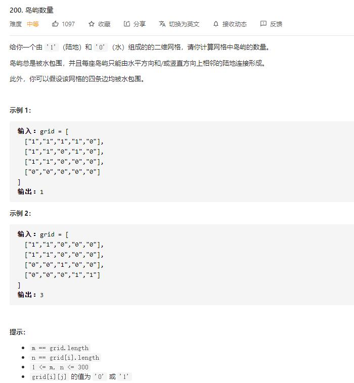

# number_of_islands

## 题目截图
 

## 思路 dfs

定义一个函数 `dfs` ，将与其同属一个岛屿的 `1` 都变成 `0`

遍历数组，遇到 `1` 则调用 `dfs` 并 `res += 1`
  

    class Solution:
    def numIslands(self, grid: List[List[str]]) -> int:
        res = 0
        def dfs(i, j):
            if i >= len(grid) or j >= len(grid[0]) or i < 0 or j < 0:
                return
            if grid[i][j] == "1":
                grid[i][j] = "0"
                dfs(i + 1, j)
                dfs(i - 1, j)
                dfs(i, j + 1)
                dfs(i, j - 1)
                
        for i in range(len(grid)):
            for j in range(len(grid[0])):
                if grid[i][j] == "1":
                    res += 1
                    dfs(i, j)
        return res
