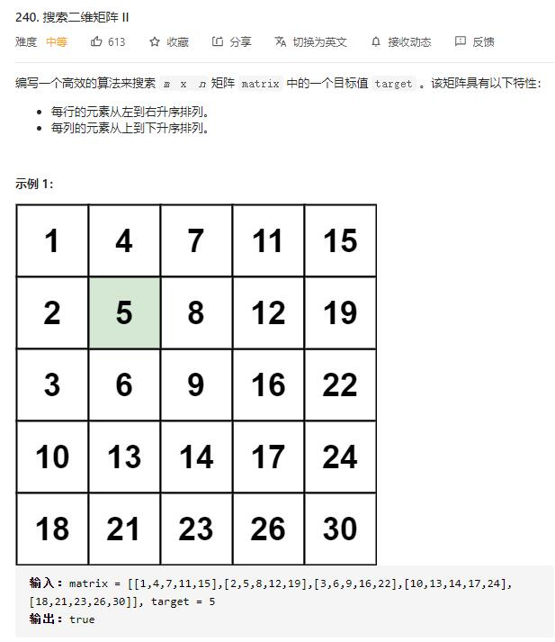

# search_a_2D_matrix_II

## 题目截图
 

## 思路 dfs

从左下角元素开始
- 若该元素大于 target, 目标元素肯定在上方
- 若该元素小于 target, 目标元素肯定在右方

从右上角同理

    class Solution:
    def searchMatrix(self, matrix: List[List[int]], target: int) -> bool:
        def search(i, j, target):
            if i < 0 or j >= len(matrix[0]):
                return False
            if matrix[i][j] > target:
                return search(i - 1, j, target)
            elif matrix[i][j] < target:
                return search(i, j + 1, target)
            else:
                return True

        return search(len(matrix) - 1, 0, target)
 
