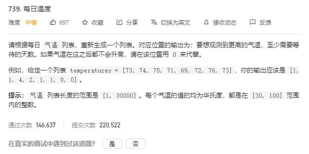

# daily_temperatures

## 题目截图
 

## 思路 单调栈

维持一个以数组索引为元素的递减单调栈

这样能保证当前进栈元素若大于栈顶元素那就是**首个大于栈顶元素**的元素
  
  
    class Solution:
        def dailyTemperatures(self, T: List[int]) -> List[int]:
            length = len(T)
            res = [0] * length
            stack = []
            for i in range(length):
                # 若栈为空或者入栈元素小于栈顶元素，则下标入栈
                if not stack or T[i] <= T[stack[-1]]:
                    stack.append(i)
                else:
                    while stack and T[i] > T[stack[-1]]:
                        tmp = stack.pop()
                        res[tmp] = i - tmp
                    stack.append(i)
            return res