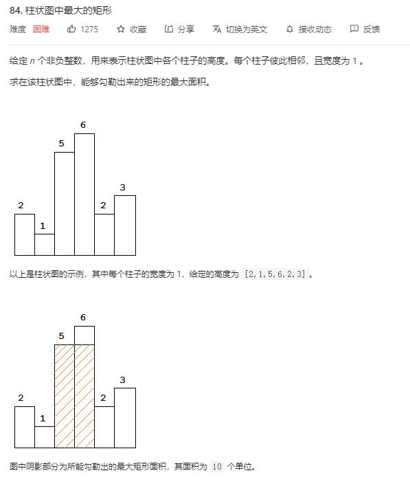

# largest_rectangle_in_histogram

## 题目截图
 

## 思路 单调栈

维持一个以数组索引为元素的递增单调栈

这样能保证当前进栈元素若大于栈顶元素那就是**首个大于栈顶元素**的元素
  

    class Solution:
    def largestRectangleArea(self, heights: List[int]) -> int:
        # 单调栈
        res, stack = 0, []
        length = len(heights)
        for i in range(length):
            # 此类题有种规律，即出来时确定元素所在位置的值
            # 即能找出来前面离它最近的比它小的元素（递增栈）或比它大的元素（递减栈）
            # 进栈时找到左边的，出栈时找到右边的

            # 入栈元素小于最后一个元素，说明
            while stack and heights[stack[-1]] > heights[i]:
                height = heights[stack.pop()]
                # 要考虑到若前面有高度相等柱子的情况
                while stack and heights[stack[-1]] == height:
                    stack.pop()
                if stack:
                    width = i - stack[-1] - 1
                else:
                    width = i
                res = max(res, height * width)
            stack.append(i)
        # 所有的柱子被遍历完后，剩下的都是递增的，且右端都是数组长度
        while stack:
            height = heights[stack.pop()]
            while stack and heights[stack[-1]] == height:
                stack.pop()
            if stack:
                width = length - stack[-1] - 1
            else:
                width = length
            res = max(res, height * width)
        return res
