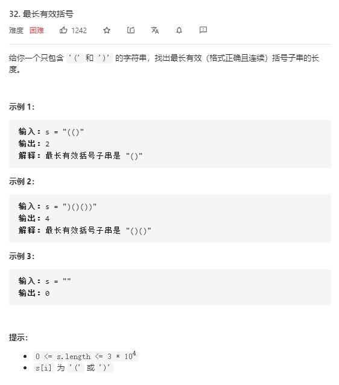

# longest_valid_parentheses

## 题目截图
 

## 思路 栈

    class Solution:
        def longestValidParentheses(self, s: str) -> int:
            # 使用栈，保存下标
            # 栈底始终保存最后一个不匹配的')'
            # 若当前元素为 '(' 直接进栈
            # 若当前元素为 ')' ，此刻栈内只有两种情况：
            # 栈内为栈底(即最后一个不匹配的')') + n * '('
            # 所以可先将栈顶元素弹出，若弹出后栈为空，则栈顶元素为最后一个不匹配的')'，将当前')'放入栈底
            # 若不为空，则当前右括号下标减去栈顶元素即为以当前括号结尾的子串长度
            # 为解决首个状态，即第一个元素放进去不匹配的问题，先在栈中放置一个 -1
            stack = [-1]
            res = 0
            for i, c in enumerate(s):
                if c == '(':
                    stack.append(i)
                else:
                    stack.pop()
                    # 若栈为空
                    if not stack:
                        stack.append(i)
                    else:
                        res = max(res, i - stack[-1])
            return res

