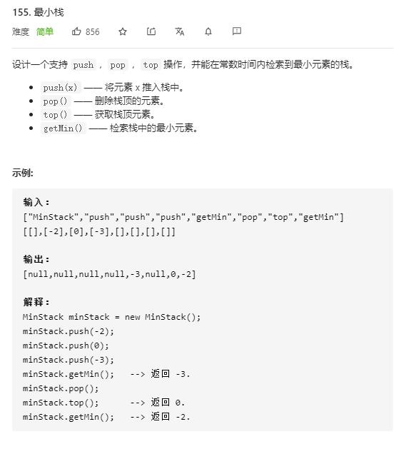

# min_stack

## 题目截图
 

## 思路 辅助栈

 

    class MinStack:

    def __init__(self):
        """
        initialize your data structure here.
        """
        # 除栈本身外，定义一个单调递减栈
        self.stack1 = []
        self.stack2 = []

    def push(self, val: int) -> None:
        self.stack1.append(val)
        if not self.stack2 or self.stack2[-1] >= val:
            self.stack2.append(val)

    def pop(self) -> None:
        tmp = self.stack1.pop()
        if tmp == self.stack2[-1]:
            self.stack2.pop()
        return tmp

    def top(self) -> int:
        return self.stack1[-1]

    def getMin(self) -> int:
        return self.stack2[-1]

    # Your MinStack object will be instantiated and called as such:
    # obj = MinStack()
    # obj.push(val)
    # obj.pop()
    # param_3 = obj.top()
    # param_4 = obj.getMin()
