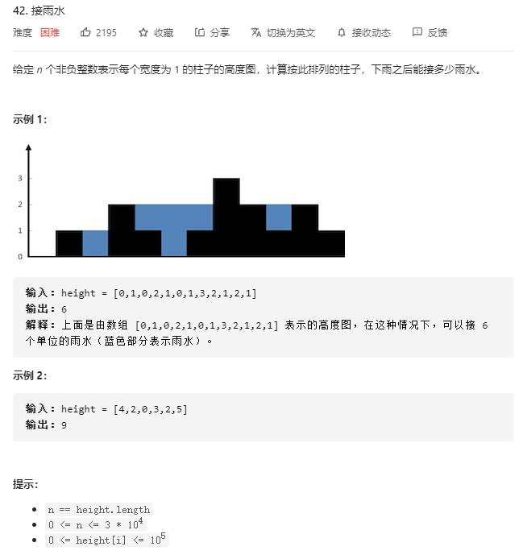

# trapping_rain_water

## 题目截图
 

## 思路 单调栈

确定当前坐标储水量需要找到其左右两边比它高的柱体

注意当前确定的并不是它最终的储水量，而是其形成的横条面积
  

    class Solution:
    def trap(self, height: List[int]) -> int:
        # 确定当前坐标储水量需要找到其左右两边比它高的索引
        # 每次加入由当前柱即两边大于它的柱确定的横长条面积
        res, stack = 0, []
        for i in range(len(height)):
            while stack and height[stack[-1]] < height[i]:
                cur_height = height[stack.pop()]
                while stack and height[stack[-1]] == cur_height:
                    stack.pop()
                if stack:
                    h = min(height[i], height[stack[-1]])
                    w = i - stack[-1] - 1
                else:
                    h = 0
                    w = 0
                res += (h - cur_height) * w
            stack.append(i)
        return res
                
