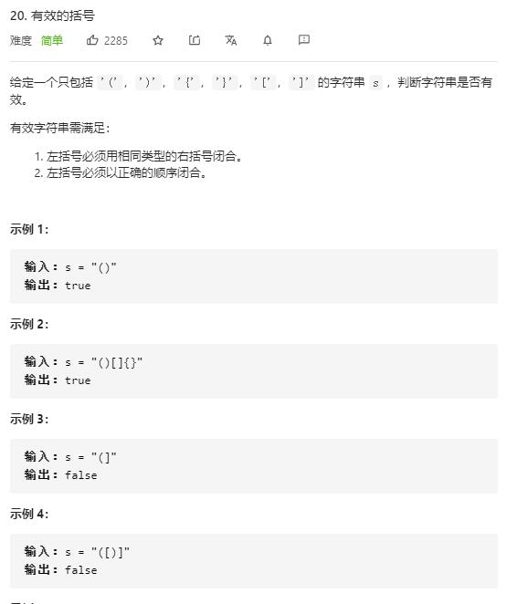

# valid_parentheses

## 题目截图
 

## 思路 栈

trick: 在栈底加入个符号 `?`就可以不用判断栈是否为空了

    class Solution:
    def isValid(self, s: str) -> bool:
        # 栈
        stack = ['?']
        dic = {"(":")", "{": "}", "[":"]", "?":"?"}
        for c in s:
            if c in dic:
                stack.append(c)
            elif dic[stack.pop()] != c:
                return False
        return len(stack) == 1
