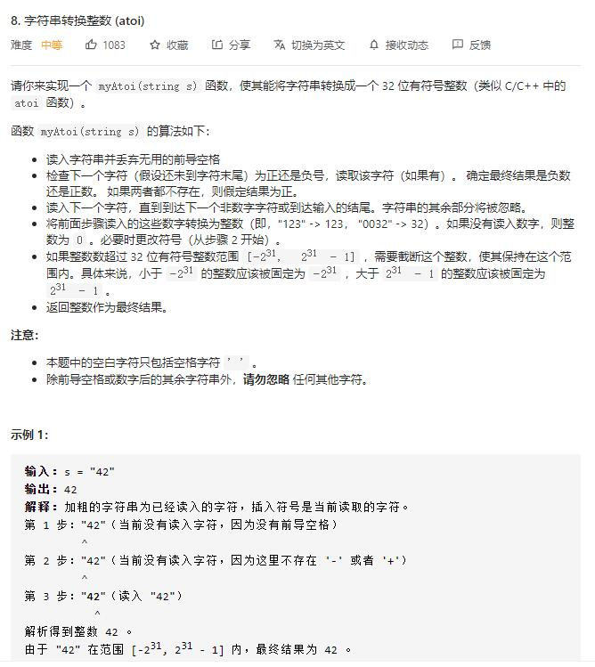

# atoi

## 题目截图
 

## 思路 逐个遍历

    class Solution:
    def myAtoi(self, s: str) -> int:
        if not s: return 0
        res, n, i, flag, bound = 0, len(s), 0, False, 2 ** 31 // 10
        while i < n and s[i] == ' ':
            i += 1
        # 判断 i 是否超出范围或者首个非空格为字母
        if i >= n or s[i] not in ['+', '-'] and (s[i] < '0' or s[i] > '9'):
            return 0
        if s[i] == '-' or s[i] == '+':
            if s[i] == '-':
                flag = True
            i += 1
        while i < n and '0' <= s[i] <= '9':
            m = ord(s[i]) - ord('0')
            # 判断是否越界
            if res > bound:
                return -2 ** 31 if flag else 2 ** 31 - 1
            if res == bound:
                # 如果为负数
                if flag and m > 8:
                    return  -2 ** 31
                elif not flag and m > 7:
                    return 2 ** 31 - 1
            res = res * 10 + m
            i += 1
        return -res if flag else res

