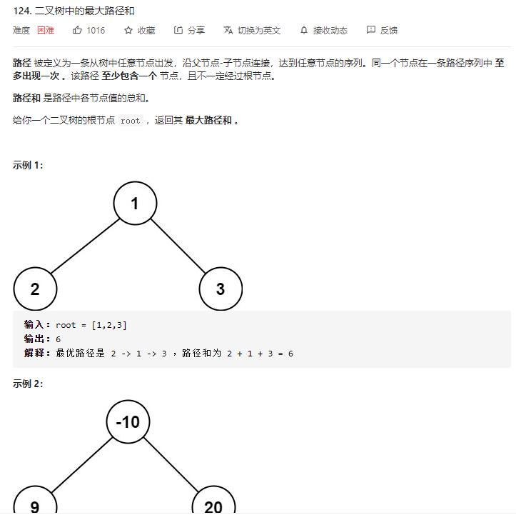

# binary_tree_maximum_path_sum

## 题目截图
 

## 思路 递归

dfs 返回根节点与左右节点较大值，这种情况可以与根节点父节点进行递归

遍历至一个节点时，最大值有三种情况：
- 左子树最大值与根节点值与右子树最大值，此种情况已经不能再递归了，可直接与全局变量比较
- 根节点值与左右子树最大值的和，返回该值

    # Definition for a binary tree node.
    # class TreeNode:
    #     def __init__(self, val=0, left=None, right=None):
    #         self.val = val
    #         self.left = left
    #         self.right = right
    class Solution:
        def __init__(self):
            self.res = float("-inf")
    
        def maxPathSum(self, root: TreeNode) -> int:
            # 采用 dfs ，返回该节点返回到父节点的路径和
            
            def dfs(node):
                # 若为空，返回0
                if not node:
                    return 0
                # 若左右子树最大值为负则抛弃，取0
                max_left = max(dfs(node.left), 0)
                max_right = max(dfs(node.right), 0)
    
                # 更新res
                self.res = max(self.res, max_left + node.val + max_right)
                return max(node.val + max_left, node.val + max_right)
            dfs(root)
            return self.res

