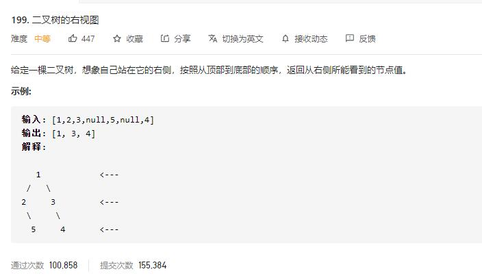

# binary_tree_right_side_view

## 题目截图
 

## 思路一 bfs

    # Definition for a binary tree node.
    # class TreeNode:
    #     def __init__(self, val=0, left=None, right=None):
    #         self.val = val
    #         self.left = left
    #         self.right = right
    class Solution:
        def rightSideView(self, root: TreeNode) -> List[int]:
            # bfs
            if not root: return []
            res = []
            queue = collections.deque()
            queue.append(root)
            while queue:
                length = len(queue)
                res.append(queue[-1].val)
                for i in range(length):
                    node = queue.popleft()
                    if node.left: queue.append(node.left)
                    if node.right: queue.append(node.right)
            return res
    

## 思路二 dfs

    # Definition for a binary tree node.
    # class TreeNode:
    #     def __init__(self, val=0, left=None, right=None):
    #         self.val = val
    #         self.left = left
    #         self.right = right
    class Solution:
        def rightSideView(self, root: TreeNode) -> List[int]:
            # dfs
            res = []
            def dfs(node, depth, res):
                if not node:
                    return
                # 如果第一次到这层
                if len(res) == depth:
                    res.append(node.val)
                depth += 1
                dfs(node.right, depth, res)
                dfs(node.left, depth, res)
            dfs(root, 0, res)
            return res
    

