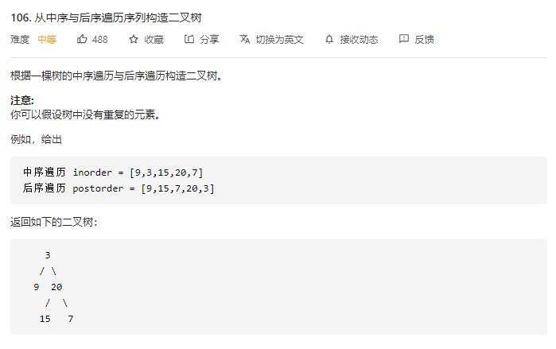

# construct_binary_tree_from_inorder_and_postorder_traversal

## 题目截图
 

## 思路 递归 反向中序遍历

    # Definition for a binary tree node.
    # class TreeNode:
    #     def __init__(self, val=0, left=None, right=None):
    #         self.val = val
    #         self.left = left
    #         self.right = right
    class Solution:
        def buildTree(self, inorder: List[int], postorder: List[int]) -> TreeNode:
            # 中序遍历 [left | root | right]
            # 后续遍历 [left | right | root]
            dic = {}
            for i, x in enumerate(inorder):
                dic[x] = i
            def helper(dic, inorder, postorder, in_left, in_right):
                if in_left > in_right:
                    return None
                root_val = postorder.pop()
                root = TreeNode(root_val)
                root.right = helper(dic, inorder, postorder, dic[root_val] + 1, in_right)
                root.left = helper(dic, inorder, postorder, in_left, dic[root_val] - 1)
                return root
            return helper(dic, inorder, postorder,0, len(inorder) - 1)

