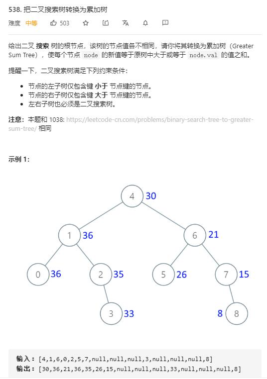

# convert_BST_to_greater_tree

## 题目截图
 

## 思路 递归 反向中序遍历

    # Definition for a binary tree node.
    # class TreeNode:
    #     def __init__(self, val=0, left=None, right=None):
    #         self.val = val
    #         self.left = left
    #         self.right = right
    class Solution:
        def convertBST(self, root: TreeNode) -> TreeNode:
            # 使用反的中序遍历即可逆序遍历，然后叠加值即可
            def dfs(node):
                if not node: return
                dfs(node.right)
                self.pre += node.val
                node.val = self.pre
                dfs(node.left)
            self.pre = 0
            dfs(root)
            return root

