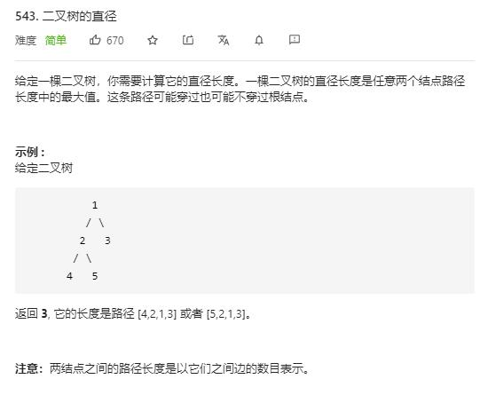

# diameter_of_binary_tree

## 题目截图
 

## 思路 递归 反向中序遍历

    # Definition for a binary tree node.
    # class TreeNode:
    #     def __init__(self, val=0, left=None, right=None):
    #         self.val = val
    #         self.left = left
    #         self.right = right
    class Solution:
        def diameterOfBinaryTree(self, root: TreeNode) -> int:
            # 为某节点的左右子树深度之和 + 1
            # 采用 dfs 
            res = 0
            def dfs(node):
                nonlocal res
                if not node: return 0
                depth_l = dfs(node.left)
                depth_r = dfs(node.right)
                res = max(res, depth_l + depth_r + 1)
                return max(depth_r, depth_l) + 1
            dfs(root)
            return res - 1
