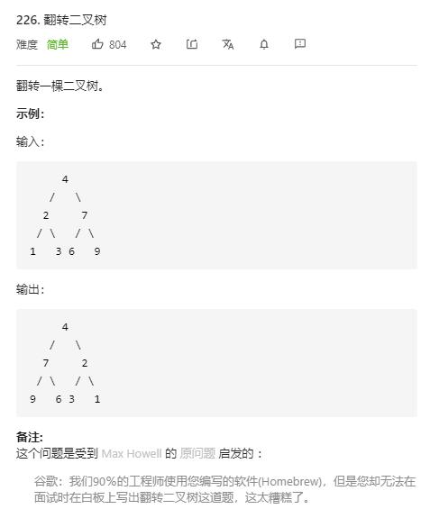

# invert_binary_tree

## 题目截图
 

## 思路 递归

    # Definition for a binary tree node.
    # class TreeNode:
    #     def __init__(self, val=0, left=None, right=None):
    #         self.val = val
    #         self.left = left
    #         self.right = right
    class Solution:
        def invertTree(self, root: TreeNode) -> TreeNode:
            # 即每个子树的左右子树交换
            if not root:
                return
            root.left, root.right = root.right, root.left
            self.invertTree(root.left)
            self.invertTree(root.right)
            return root
                