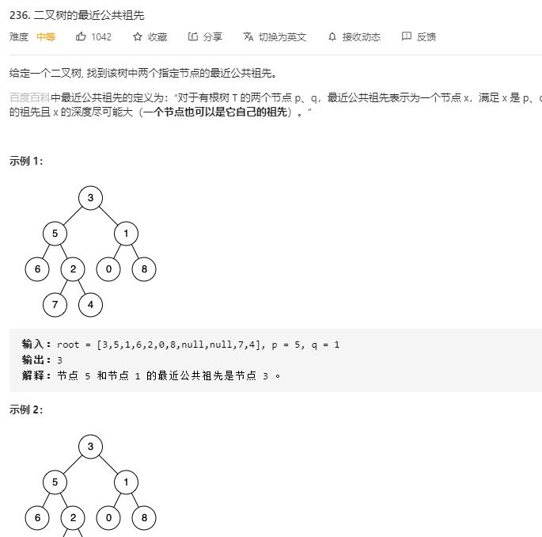

# lowest_common_ancestor_of_a_binary_tree

## 题目截图
 

## 思路一 递归

采用DFS

- 若遇到空节点或值为 `p` `q` 则返回

- 左右子树返回的值有以下几种情况：
    - 两边都非空，则当前节点为最深父节点，返回`root`
    - 只有一边为空，则返回那边（此时可能存在两个点都在该点子树）
    - 两边都为空，返回空

    # Definition for a binary tree node.
    # class TreeNode:
    #     def __init__(self, x):
    #         self.val = x
    #         self.left = None
    #         self.right = None
    
    class Solution:
        def lowestCommonAncestor(self, root: 'TreeNode', p: 'TreeNode', q: 'TreeNode') -> 'TreeNode':
            # 深度遍历
            if not root:
                return None
            if root.val == p.val or root.val == q.val:
                return root
            left = self.lowestCommonAncestor(root.left, p, q)
            right = self.lowestCommonAncestor(root.right, p, q)
            # p q 不在左边
            if not left:
                return right
            # p q 不在右边
            if not right:
                return left
            # p q 在两侧，则该节点为最近公共祖先
            return root
            
