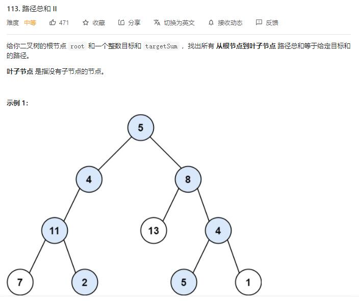

# path_sum_II

## 题目截图
 

## 思路一 回溯

    # Definition for a binary tree node.
    # class TreeNode:
    #     def __init__(self, val=0, left=None, right=None):
    #         self.val = val
    #         self.left = left
    #         self.right = right
    class Solution:
        def pathSum(self, root: TreeNode, targetSum: int) -> List[List[int]]:
            # 回溯
            
            def dfs(node, s, res, tmp):
                if not node:
                    return
                tmp.append(node.val)
                s -= node.val
                if s == 0 and not node.left and not node.right:
                    res.append(tmp[:])
                dfs(node.left, s, res, tmp)
                dfs(node.right, s, res, tmp)
                tmp.pop()
            res, tmp = [], []
            dfs(root, targetSum, res, tmp)
            return res
