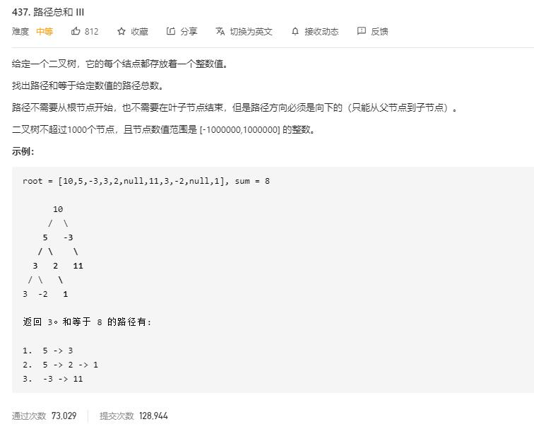

# path_sum_III

## 题目截图
 

## 思路一 回溯 + 前缀和

    # Definition for a binary tree node.
    # class TreeNode:
    #     def __init__(self, val=0, left=None, right=None):
    #         self.val = val
    #         self.left = left
    #         self.right = right
    class Solution:
        def pathSum(self, root: TreeNode, sum: int) -> int:
            # 使用字典记录前缀和及其出现的次数
            dic = {0: 1}
            def dfs(node, num):
                if not node:
                    return 0
                count = 0
                tmp = node.val + num
                if tmp - sum in dic:
                    count += dic[tmp - sum]
                if tmp in dic:
                    dic[tmp] += 1
                else:
                    dic[tmp] = 1
                count += dfs(node.left, tmp)
                count += dfs(node.right, tmp)
                # 回溯
                dic[tmp] -= 1
                return count
            return dfs(root, 0)
