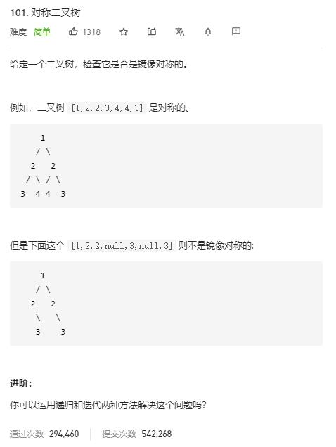

# symmetric_tree

## 题目截图
 

## 思路 递归

    # Definition for a binary tree node.
    # class TreeNode:
    #     def __init__(self, val=0, left=None, right=None):
    #         self.val = val
    #         self.left = left
    #         self.right = right
    class Solution:
        def isSymmetric(self, root: TreeNode) -> bool:
            def helper(left, right):
                # 出口：比较的两节点皆为空或者不相等
                if not left and not right:
                    return True
                if not left or not right or left.val != right.val:
                    return False
                return helper(left.left, right.right) and helper(left.right, right.left) 
            return helper(root.left, root.right)

## 思路二 队列

    # Definition for a binary tree node.
    # class TreeNode:
    #     def __init__(self, val=0, left=None, right=None):
    #         self.val = val
    #         self.left = left
    #         self.right = right
    class Solution:
        def isSymmetric(self, root: TreeNode) -> bool:
            # BFS
            if not root or not (root.left or root.right):
                return True
            queue = collections.deque()
            queue.append(root.left)
            queue.append(root.right)
            while queue:
                left = queue.popleft()
                right = queue.popleft()
                # 如果左右节点都为空
                if not left and not right:
                    continue
                if not left or not right:
                    return False
                if left.val != right.val:
                    return False
                queue.append(left.left)
                queue.append(right.right)
                queue.append(left.right)
                queue.append(right.left)
            return True