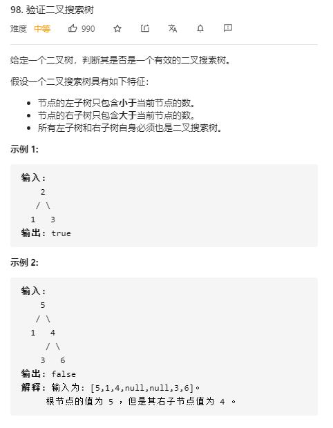

# validate_binary_search_tree

## 题目截图
 

## 思路 递归

 

    # Definition for a binary tree node.
    # class TreeNode:
    #     def __init__(self, val=0, left=None, right=None):
    #         self.val = val
    #         self.left = left
    #         self.right = right
    class Solution:
        def isValidBST(self, root: TreeNode) -> bool:
            # 递归
            # 二叉搜索树有个性质，中序遍历为递增序列
            def dfs(res, node):
                if not node:
                    return 
                dfs(res, node.left)
                res.append(node.val)
                dfs(res, node.right)
            res = []
            dfs(res, root)
            for i in range(len(res) - 1):
                if res[i + 1] <= res[i]:
                    return False
            return True
    
    # 更简洁的代码
    # Definition for a binary tree node.
    # class TreeNode:
    #     def __init__(self, val=0, left=None, right=None):
    #         self.val = val
    #         self.left = left
    #         self.right = right
    class Solution:
    
        def __init__(self):
            self.pre = float("-inf")
    
        def isValidBST(self, root: TreeNode) -> bool:
            # 中序遍历
            if not root:
                return True
            if not self.isValidBST(root.left):
                return False
            if root.val <= self.pre:
                return False
            self.pre = root.val
            return self.isValidBST(root.right)
            
## 思路二 用栈实现中序遍历

    # Definition for a binary tree node.
    # class TreeNode:
    #     def __init__(self, val=0, left=None, right=None):
    #         self.val = val
    #         self.left = left
    #         self.right = right
    class Solution:
    
        def isValidBST(self, root: TreeNode) -> bool:
            # 用栈实现中序遍历
            stack, pre = [], float("-inf")
            while stack or root:
                # 首先直接将所有左子树都进栈
                while root:
                    stack.append(root)
                    root = root.left
                root = stack.pop()
                if root.val <= pre:
                    return False
                pre = root.val
                root = root.right
            return True

